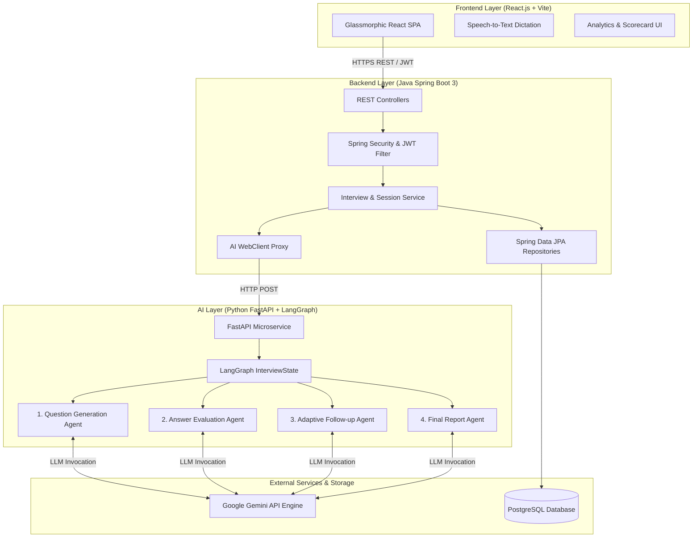
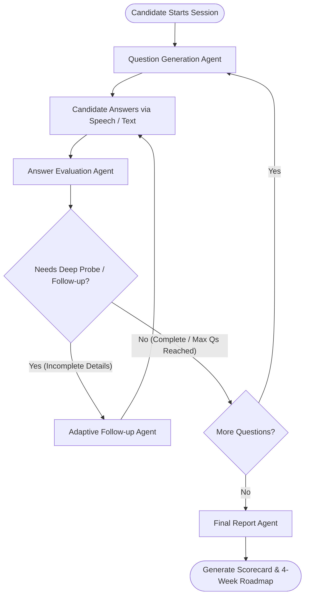
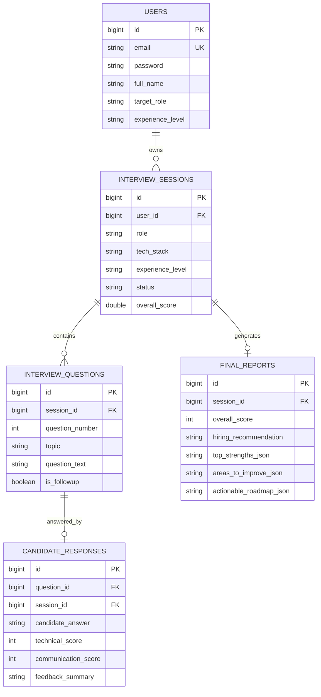

<div align="center">

  # 🤖 AI Mock Interview Platform
  ### *Empowering Candidates with Stateful Multi-Agent AI & Enterprise Architecture*

  [](https://spring.io/projects/spring-boot)
  [](https://langchain-ai.github.io/langgraph/)
  [](https://react.dev/)
  [](https://ai.google.dev/)
  [](https://www.postgresql.org/)
  [](LICENSE)

  <p align="center">
    <b>An end-to-end multi-agent interview platform that simulates realistic technical interviews, evaluates candidate answers in real-time, asks adaptive follow-up probes, and generates personalized performance scorecards with 4-week learning roadmaps.</b>
  </p>

</div>

---

## 📌 Table of Contents
- [Overview](#-overview)
- [Key Features](#-key-features)
- [System Architecture](#-system-architecture)
- [Multi-Agent LangGraph Workflow](#-multi-agent-langgraph-workflow)
- [Tech Stack & Rationale](#-tech-stack--rationale)
- [Database Schema](#-database-schema)
- [Getting Started](#-getting-started)
  - [Prerequisites](#prerequisites)
  - [1. AI Microservice Setup](#1-ai-microservice-setup)
  - [2. Spring Boot Backend Setup](#2-spring-boot-backend-setup)
  - [3. React Frontend Setup](#3-react-frontend-setup)
- [API Endpoints Reference](#-api-endpoints-reference)
- [Project Documentation](#-project-documentation)
- [License & Acknowledgments](#-license--acknowledgments)

---

## 🌟 Overview

The **AI Mock Interview Platform** goes beyond traditional single-prompt chatbot wrappers by leveraging **LangGraph's stateful multi-agent orchestration**. 

Instead of generating basic static questions, our multi-agent pipeline acts like a hiring panel at a top tech firm:
1. **Targeted Questioning**: Generates role-specific, difficulty-calibrated technical questions based on candidate profile.
2. **Real-time Evaluation**: Analyzes technical correctness, communication clarity, and system design depth.
3. **Adaptive Probing**: If a candidate misses key edge cases or gives an incomplete answer, an adaptive follow-up agent steps in to probe deeper.
4. **Comprehensive Analysis**: Synthesizes structured scorecards, identifies core strengths, highlights improvement areas, and generates an actionable **4-week learning roadmap**.

---

## ✨ Key Features

- 🤖 **LangGraph Multi-Agent Engine**: Modular graph state machine with 4 specialized agents powered by **Google Gemini API**.
- 🔒 **Enterprise JWT Security**: Secure Spring Boot 3 REST APIs backed by Spring Security and BCrypt password encryption.
- 🎙️ **Interactive Voice & Speech-to-Text**: Built-in Web Speech API integration allowing candidates to speak or type technical responses.
- 📊 **Visual Scorecards & Analytics**: Interactive radar breakdown for Technical Depth, Communication Clarity, and System Architecture.
- 🗺️ **Personalized 4-Week Roadmap**: AI-generated weekly study plan addressing candidate skill gaps.
- 🗄️ **Relational Persistence**: PostgreSQL schema storing full interview transcripts, scoring history, and user profiles.

---

## 🏗️ System Architecture



---

## 🔄 Multi-Agent LangGraph Workflow



### Agent Roles & Responsibilities:

| Agent | Purpose | LLM Output |
| :--- | :--- | :--- |
| **1. Question Agent** | Formulates role-tailored technical questions | `topic`, `question_text`, `focus_area`, `difficulty` |
| **2. Evaluator Agent** | Scores technical accuracy, clarity & depth (1-10) | `technical_score`, `strengths`, `improvements`, `needs_followup` |
| **3. Follow-up Agent** | Probes missing edge cases or ambiguous statements | `followup_question_text`, `focus`, `hint` |
| **4. Summary Agent** | Aggregates session performance & creates roadmap | `overall_score`, `hiring_recommendation`, `actionable_roadmap` |

---

## 🛠️ Tech Stack & Rationale

| Layer | Technology | Why We Used It |
| :--- | :--- | :--- |
| **Frontend** | React 18, Vite, Lucide Icons, Recharts | Fast SPA rendering, component modularity, interactive score visualization. |
| **Backend API** | Spring Boot 3, Java 17+ | Enterprise-grade stability, dependency injection, robust security ecosystem. |
| **Security** | Spring Security, JJWT | Stateless authentication with JWT token lifecycle management. |
| **AI Orchestrator** | LangGraph, Python 3.11, FastAPI | Stateful graph state control for multi-agent LLM execution loops. |
| **LLM Provider** | Google Gemini API | Low latency, fast structured JSON extractions, long context window. |
| **Database** | PostgreSQL / H2 In-Memory | Relational transaction safety, indexing, structured data persistence. |

---

## 🗄️ Database Schema



---

## 🚀 Getting Started

### Prerequisites
- **Java**: JDK 17 or higher
- **Node.js**: v18.0 or higher
- **Python**: v3.11 or higher
- **Maven**: 3.8+ (or included Maven wrapper)
- **Gemini API Key**: Obtain from [Google AI Studio](https://aistudio.google.com/)

---

### 1. AI Microservice Setup (Python LangGraph)

```bash
# Navigate to AI service
cd ai-service

# Create virtual environment
python -m venv venv
# On Windows:
venv\Scripts\activate
# On Linux/macOS:
source venv/bin/activate

# Install dependencies
pip install -r requirements.txt

# Configure Environment Variables
cp .env.example .env
# Open .env and add your GEMINI_API_KEY=your_actual_key

# Run FastAPI Server
python app/main.py
```
> Server will start at: `http://localhost:8000` (Swagger docs available at `http://localhost:8000/docs`)

---

### 2. Spring Boot Backend Setup (Java)

```bash
# Navigate to backend
cd backend

# Build application
mvn clean package -DskipTests

# Run Spring Boot Application
mvn spring-boot:run
```
> REST API will start at: `http://localhost:8080` (H2 Console: `http://localhost:8080/h2-console`)

---

### 3. React Frontend Setup (Vite)

```bash
# Navigate to frontend
cd frontend

# Install Node modules
npm install

# Start Vite Development Server
npm run dev
```
> Open browser at: `http://localhost:5173`

---

## 🔗 API Endpoints Reference

### Authentication Endpoints (`/api/auth`)
- `POST /api/auth/register` - Create user profile and return JWT token.
- `POST /api/auth/login` - Authenticate user credentials and return JWT token.
- `GET /api/auth/me` - Fetch authenticated user details.

### Interview Session Endpoints (`/api/interview`)
- `POST /api/interview/start` - Initialize session and generate Q1 via AI Service.
- `POST /api/interview/submit-answer` - Submit answer for evaluation & receive next question/follow-up.
- `GET /api/interview/my-sessions` - Retrieve candidate's interview history.
- `GET /api/interview/session/{id}` - Fetch session details, questions, answers, and final report.

### Analytics Endpoints (`/api/analytics`)
- `GET /api/analytics/dashboard` - Get high-level candidate metrics and progress trends.

---

## 📚 Project Documentation

For in-depth architecture specs, API dictionaries, database schemas, and AI agent prompt design, explore our documentation directory:

- 📑 [Architecture Specifications (`docs/ARCHITECTURE.md`)](docs/ARCHITECTURE.md)
- 🔌 [API Specs & Payload Dictionary (`docs/API_DOCUMENTATION.md`)](docs/API_DOCUMENTATION.md)
- 🗄️ [Database Dictionary (`docs/DATABASE_SCHEMA.md`)](docs/DATABASE_SCHEMA.md)
- 🧠 [LangGraph Agent Workflow Guide (`docs/AGENT_WORKFLOW.md`)](docs/AGENT_WORKFLOW.md)

---

## 📄 License & Acknowledgments

Distributed under the **MIT License**. See `LICENSE` for more information.

Built with ❤️ by [Musharraf](https://github.com/Musharraf2) using Spring Boot, LangGraph, React.js, and Google Gemini.