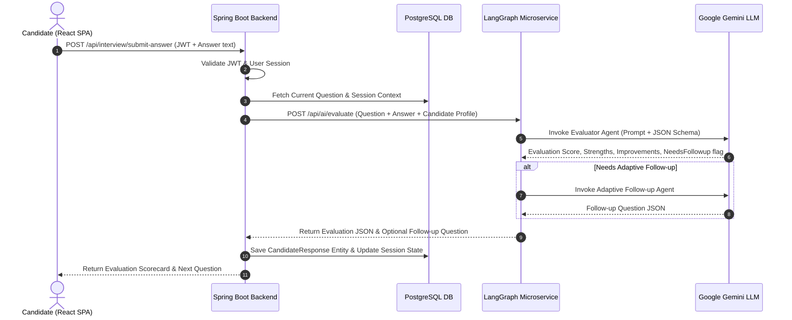

# System Architecture Specification

This document provides a detailed architectural breakdown of the **AI Mock Interview Platform**, covering microservices design, network topology, security model, and data flow.

---

## 🏛️ High-Level System Architecture

The application adopts a **decoupled 3-tier hybrid microservice architecture**:

1. **Presentation Tier (React.js SPA)**: Single Page Application built with Vite, serving glassmorphism UI, client-side routing, speech-to-text dictation, and visual metric charts.
2. **Core Enterprise Tier (Spring Boot REST API)**: Manages business logic, user authentication, session lifecycle, transaction persistence in PostgreSQL, and proxies AI tasks.
3. **AI Agentic Microservice (FastAPI + LangGraph)**: Stateful multi-agent graph server executing LLM logic using Google Gemini API.

```
+-----------------------------------------------------------------------+
|                         React.js Frontend SPA                         |
|   (Auth Context, Session Manager, Simulator, Speech API, Scorecards)  |
+-----------------------------------+-----------------------------------+
                                    |
                                    | HTTPS REST (JWT Bearer)
                                    v
+-----------------------------------------------------------------------+
|                    Spring Boot REST API Backend                       |
|   (Spring Security, JPA Repositories, AuthService, SessionService)    |
+-----------------+---------------------------------+-------------------+
                  |                                 |
     SQL (JDBC)   v                                 v  HTTP POST (JSON)
+-------------------+             +-------------------------------------+
| PostgreSQL / H2   |             |    LangGraph AI Microservice        |
| Relational DB     |             |   (FastAPI, StateGraph, Gemini)     |
+-------------------+             +------------------+------------------+
                                                     |
                                                     v  HTTPS API
                                          +---------------------+
                                          | Google Gemini API   |
                                          +---------------------+
```

---

## 🔄 End-to-End Sequence Diagram

The following sequence diagram outlines the interactive workflow when a candidate submits an answer during a mock interview:



---

## 🔒 Security Model

### 1. Authentication & Authorization
- **Stateless JWT Security**: Upon successful login (`POST /api/auth/login`), Spring Security generates a signed JSON Web Token (HMAC-SHA256).
- **Authorization Filter**: `JwtAuthenticationFilter` intercepts incoming HTTP requests, extracts the `Authorization: Bearer <token>` header, verifies token signature and expiration, and populates the `SecurityContextHolder`.
- **Password Hashing**: User passwords are encrypted using `BCryptPasswordEncoder` with a strength factor of 10.

### 2. CORS Policy
- Configured in `SecurityConfig.java` to permit controlled cross-origin requests from the React frontend port while denying unauthorized domains.

---

## 📡 Service Communication Protocol

- **Frontend <-> Spring Boot**: Synchronous HTTP/REST JSON over port `8080`.
- **Spring Boot <-> LangGraph Microservice**: Synchronous HTTP/REST JSON over port `8000`.
- **LangGraph <-> Gemini API**: HTTPS TLS 1.3 REST calls to `generativelanguage.googleapis.com`.
